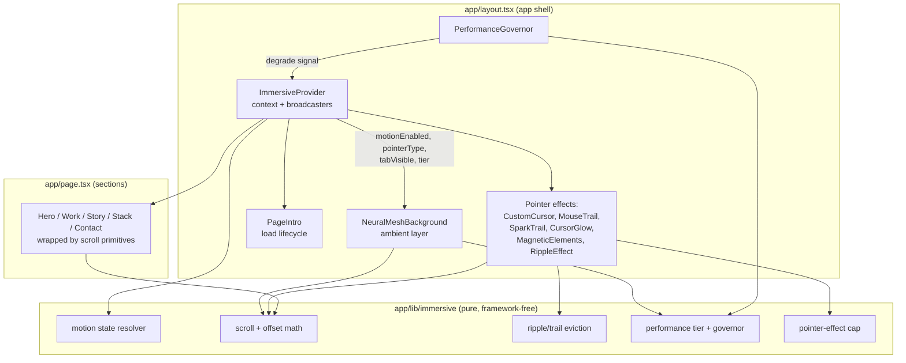
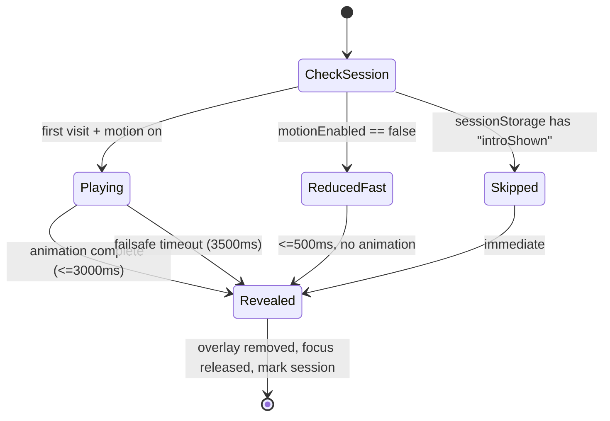

# Design Document

## Overview

The portfolio already ships a large immersive stack, but it is uncoordinated: every pointer/scroll component attaches its own `window` listeners and runs its own `requestAnimationFrame` loop, reduced-motion is only enforced through a global CSS `animation-duration` override (which does nothing for canvas, WebGL, or framer-motion JS-driven `animate` loops), several capable components are never mounted, and there is no shared notion of device capability, tab visibility, or a performance budget.

This design makes the immersive layer **intentional, cohesive, performant, and accessible** without rewriting the existing visual components. The strategy is to introduce a thin **coordination layer** — one React context plus a small set of hooks and a pure-logic module — that the existing components subscribe to instead of each managing global state independently. On top of that layer we:

1. Establish a **single reactive source of truth for motion preference** so effects start/stop live within 500 ms of an OS setting change (Req 1).
2. **Activate the idle components** by assigning each to exactly one Section under a strict "one effect category per Section" rule (Req 2).
3. Build **scroll storytelling** on a shared reveal/parallax primitive with bounded offsets and once-only entrance (Req 3).
4. **Coordinate and cap pointer effects** through a shared pointer broadcaster and an effect registry (Req 4, Req 7).
5. Harden the **ambient background** with visibility pause/resume and capability-based element counts (Req 5).
6. Rebuild the **page-load intro lifecycle** with a session guard, reduced-motion fast path, failsafe timeout, and focus containment (Req 6).
7. Add a **performance governor** that measures frame budget and sheds the costliest effects when the site falls behind (Req 7).
8. Enforce **accessibility invariants** (decorative isolation, focus order, visible focus) across the layer (Req 8).

A guiding principle from the existing code: `NeuralMeshBackground` already models capability handling (core count, mobile, reduced motion, DPR clamping) well. The coordination layer generalizes that same discipline so every component inherits it rather than reinventing it.

### Design Decisions and Rationale

- **Context + hooks over prop drilling or per-component globals.** The immersive components are scattered across `app/layout.tsx` (app shell) and individual sections. A React context mounted high in the tree lets any component read reactive capability state (`motionEnabled`, `pointerType`, `tabVisible`, `performanceTier`) with a single subscription each, replacing dozens of duplicated `matchMedia`/`mousemove`/`scroll` listeners.
- **Extract pure logic from rendering.** All numeric/stateful decisions (scroll-progress math, offset clamping, ripple eviction, tier selection, effect capping) move into a framework-free module `app/lib/immersive/`. This is the seam that makes the feature testable with property-based tests while the DOM/canvas/WebGL rendering stays in components verified by example/snapshot tests.
- **Do not rewrite working visuals.** `NeuralMeshBackground`, `PageIntro`, `CustomCursor`, etc. keep their visual logic; they are refactored only to (a) subscribe to the context and (b) delegate their numeric decisions to the pure module.
- **Idle-component activation is curated, not exhaustive.** Requirement 2 asks for activation "where they add value." Two idle components are intentionally **not** activated with documented rationale (see Components section), which the requirements explicitly permit.

## Architecture

### Layered View



### Coordination Layer

`ImmersiveProvider` is a client component mounted once at the top of `<body>` in `app/layout.tsx`, wrapping everything else. It owns four reactive capability signals and two broadcasters:

| Signal | Source | Consumers | Requirement |
|---|---|---|---|
| `motionEnabled` | `matchMedia("(prefers-reduced-motion: reduce)")` with a live `change` listener | every animated component | 1.1–1.5 |
| `pointerType` (`fine` \| `coarse`) | `matchMedia("(pointer: fine)")` / `(hover: hover)` | pointer components | 4.2, 7.2 |
| `tabVisible` | `document.visibilitychange` | background + rAF loops | 5.3, 5.4, 7.4 |
| `performanceTier` (`full` \| `reduced` \| `minimal`) | `navigator.hardwareConcurrency` + live governor feedback | background, pointer, scroll | 5.5, 7.6 |

**Broadcasters** avoid N duplicate `window` listeners:
- **Pointer broadcaster**: one `mousemove` listener updates a shared position ref and notifies subscribers **at most once per animation frame** (Req 7.3). Subscribers register via `usePointerBroadcast(handler, { priority })`.
- **Frame clock**: a single shared `requestAnimationFrame` loop drives subscribed effects, so the governor can pause/throttle everything centrally (Req 7.3, 7.4).

Because `matchMedia` and `document` are browser-only, the provider resolves all signals to safe SSR defaults (motion enabled = false during SSR to render final state, pointer = coarse, tab = visible) and hydrates on mount. `suppressHydrationWarning` is already set on `<body>`.

### Reduced-Motion Strategy (Req 1)

The existing global CSS block only neutralizes CSS-declared animations. JS-driven motion (canvas particle loops, three.js render loop, framer-motion `animate={{...}}` loops) is unaffected, and nothing reacts to a **live** preference change. The strategy:

1. **Reactive hook** `useReducedMotion()` reads `ImmersiveProvider.motionEnabled`. When the OS preference flips, the `change` event updates context state, React re-renders subscribers, and effects enable/disable within one render tick — well under the 500 ms budget (Req 1.3, 1.4) and with no reload.
2. **Final-state-first rendering.** Reveal components (`SectionTransition`, `ImmersiveText`, `EncryptReveal`) read `motionEnabled`; when motion is off they render children in the final visible state with `initial === animate` (no reveal) (Req 1.2, 3.5).
3. **Continuous loops gate on the flag.** Pointer trails and the ambient loop check `motionEnabled` each frame; when it becomes `false` they stop scheduling frames and settle elements to rest (Req 1.1, 1.4). framer-motion elements animate to their resting `transform` once, then hold.
4. **Ambient static frame.** `NeuralMeshBackground` renders exactly one frame and does not schedule further frames while motion is off; on a live flip to reduce it cancels its loop after settling (Req 1.5, 5.6).

### Scroll Storytelling Architecture (Req 3)

Sections are wrapped by scroll primitives, each subscribing to the shared frame clock rather than adding its own `scroll` listener. All scroll-driven numbers flow through the pure module:

- **Reveal**: `useSectionReveal(ref)` uses one `IntersectionObserver` (threshold ≈ 0.1 of section height) and flips a latched `revealed` boolean. Once `true` it never returns to `false` (Req 3.6). Entrance animation targets complete within 1000 ms (Req 3.1).
- **Parallax/depth offset**: `computeParallaxOffset(scrollY, elementTop, viewportH, speed)` returns an offset **clamped to ±100 px** (Req 3.3). On scroll idle (>100 ms without a scroll event) the offset eases back toward 0 within 500 ms (Req 3.4).
- **ScrollProgress**: `computeScrollProgress(scrollY, scrollHeight, clientHeight)` returns a value **clamped to [0, 100]**, updated at most once per frame (Req 3.2).

### Pointer Coordination and Capping (Req 4, Req 7)

All pointer-followers subscribe to the pointer broadcaster and register with the **pointer-effect registry**. The registry enforces a configurable cap (`MAX_CONCURRENT_POINTER_EFFECTS`, default 4) using `selectActivePointerEffects(registered, cap, tier)`: it keeps the highest-priority effects up to the cap and to the tier budget, deactivating the rest. Priority ordering (highest first): `CustomCursor` > `CursorGlow` > `MagneticElements` > `MouseTrail` > `SparkTrail`. `RippleEffect` is discrete (pointer-down), not a continuous follower, so it is exempt from the cap but keeps its own ≤10 concurrent-ripple limit with oldest-first eviction (Req 4.5, 4.6).

On a coarse pointer, all cursor-following components render `null` (Req 4.2, 7.2). Magnetic translation is clamped to ≤20 px via `clampMagneticOffset` (Req 4.3) and returns to rest within 500 ms on pointer-leave (Req 4.4). The custom cursor always keeps a visible indicator; if it is disabled the native cursor is restored (Req 4.8).

### Ambient Background Layer (Req 5)

`NeuralMeshBackground` is refactored to subscribe to the context:
- **Visibility pause/resume** (currently missing): when `tabVisible` becomes `false` it cancels its rAF within 500 ms; when `true` it resumes (Req 5.3, 5.4, 7.4).
- **Element count** derives from `computeElementCount(tier, hardwareConcurrency)`; devices with ≤4 cores get ≤50% of the full node count (Req 5.5) — the component already approximates this and is brought under the shared pure function.
- **Stacking + isolation**: stays at `z-index: 0`, `pointer-events: none`, `aria-hidden` (Req 5.1, 8.1, 8.2).
- **Contrast**: background opacity/brightness are bounded so foreground body text keeps ≥4.5:1 contrast at every frame (Req 5.2).
- **Init failure**: WebGL init is wrapped so a failure removes the canvas and leaves content fully interactive with no visible error (Req 7.5).

### Page-Load Intro Lifecycle (Req 6)

`PageIntro` is rebuilt around an explicit state machine:



- Overlay is full-viewport above all content while visible, and blocks focus from entering underlying content via `inert`/focus trap (Req 6.1, 6.4).
- On reveal it fully unmounts, leaving no element that intercepts pointer/focus, and restores `body` scroll/overflow (Req 6.3).
- **Failsafe**: an independent 3500 ms timeout guarantees reveal even if the animation stalls (Req 6.6).
- **Session guard**: `sessionStorage["immersive:introShown"]` makes the intro show once per session (Req 6.7).
- **Reduced-motion**: reveals within 500 ms with no animated sequence (Req 6.5).

### Performance Governor (Req 7)

`usePerformanceGovernor()` samples frame timestamps from the shared frame clock, maintains a rolling 5-second window, and computes the fraction of frames within the 16.7 ms budget. When that fraction drops below 90%, it lowers `performanceTier` (`full → reduced → minimal`), which the registry and background read to shed the costliest effects (bloom, particle counts, trail density, then pointer followers). When frames recover it may step the tier back up with hysteresis to avoid oscillation (Req 7.1, 7.6). It pauses sampling while the tab is hidden (Req 7.4).

## Components and Interfaces

### New: Coordination Layer

**`app/components/immersive/ImmersiveProvider.tsx`** (client)
```ts
interface ImmersiveState {
  motionEnabled: boolean;        // false => reduced motion
  pointerType: "fine" | "coarse";
  tabVisible: boolean;
  performanceTier: "full" | "reduced" | "minimal";
}
// Context value adds: subscribePointer(fn, opts), subscribeFrame(fn), registerPointerEffect(id, priority)
```

**Hooks** (`app/hooks/`)
- `useReducedMotion(): boolean` — reactive motion flag (replaces ad-hoc `matchMedia`).
- `usePointerCapability(): "fine" | "coarse"`.
- `useTabVisibility(): boolean`.
- `usePointerBroadcast(handler, opts?)` — subscribe to throttled pointer position.
- `useFrameClock(handler)` — subscribe to the shared rAF loop.
- `usePerformanceTier(): Tier`.
- `useSectionReveal(ref): boolean` — latched, once-only reveal.

### New: Pure Logic Module

**`app/lib/immersive/`** (no React, no DOM types beyond plain numbers)
```ts
// scroll.ts
computeScrollProgress(scrollY: number, scrollHeight: number, clientHeight: number): number; // [0,100]
computeParallaxOffset(scrollY, elementTop, viewportH, speed, max=100): number;               // [-max,max]
blendTopology(scroll: number, sectionCount: number): { fromIdx: number; toIdx: number; t: number };

// pointer.ts
clampMagneticOffset(dx: number, dy: number, max=20): { x: number; y: number };               // |.|<=max
selectActivePointerEffects(effects: EffectDesc[], cap: number, tier: Tier): string[];         // <=cap

// ripple.ts
pushWithCap<T>(items: T[], next: T, cap: number): T[];   // keeps newest, evicts oldest, length<=cap

// performance.ts
frameFraction(timestamps: number[], windowMs: number, budgetMs: number): number;  // [0,1]
selectTier(currentTier: Tier, fraction: number, threshold=0.9): Tier;             // monotone step
computeElementCount(tier: Tier, cores: number, full: number): number;

// motion.ts
resolveMotionState(prefReduce: boolean): { animate: boolean; loop: boolean };
```

### Modified: Existing Components

| Component | Change | Requirements |
|---|---|---|
| `layout.tsx` | Wrap tree in `ImmersiveProvider`; mount `PerformanceGovernor` | 1, 7 |
| `NeuralMeshBackground` | Subscribe to `tabVisible`, `motionEnabled`, `performanceTier`; add visibility pause/resume; route counts through `computeElementCount`; wrap WebGL init in try/catch fallback | 5.3–5.6, 7.4, 7.5 |
| `PageIntro` | Rebuild lifecycle: session guard, reduced-motion fast path, 3500 ms failsafe, focus containment, full unmount | 6.1–6.7 |
| `CustomCursor`, `MouseTrail`, `SparkTrail`, `CursorGlow`, `MagneticElements` | Subscribe to pointer broadcaster + registry; render `null` on coarse pointer; gate loops on `motionEnabled` | 4.1–4.4, 4.7, 7.2, 7.3 |
| `RippleEffect` | Route eviction through `pushWithCap(..., 10)` | 4.5, 4.6 |
| `ScrollProgress` | Route through `computeScrollProgress`; throttle to one update/frame | 3.2, 7.3 |
| `ParallaxSection`, `ScrollDepth` | Route offset through `computeParallaxOffset` (±100 px); gate on motion | 3.3, 3.4, 3.5 |
| `SectionTransition`, `ImmersiveText` | Use `useSectionReveal`; final-state render when motion off; once-only | 3.1, 3.5, 3.6 |

### Idle Component Activation Plan (Req 2)

**Effect categories** (Req 2.4 — at most one per category per Section): **(A) parallax/depth translation**, **(B) scroll-driven reveal**, **(C) transition animation**. Pointer-driven (`MouseParallax`, `InteractiveSpotlight`) and hover accents (`ScrambleText`) are **not** in these categories, so they may coexist with A/B/C. Sections already consume `EncryptReveal` (a category-B reveal) in places; the matrix avoids stacking a second B on the same content.

| Idle Component | Assigned Section | Category | Rationale |
|---|---|---|---|
| `SectionTransition` | Work | C (transition) | Entrance transition for the Work grid; Work has no existing reveal wrapper on its container. |
| `ImmersiveText` | Story heading | B (reveal) | Character-stagger reveal on the narrative heading; Story body keeps its existing reveal, heading is distinct content. |
| `ScrollDepth` | Stack | A (depth) | Subtle depth tilt on the crystalline Stack grid; no existing translation wrapper there. |
| `ParallaxSection` | Contact | A (parallax) | Gentle parallax lift on the Contact block; Contact has no existing translation. |
| `WaveSection` | Story → Stack boundary | C (transition/divider) | Animated wave divider as a section boundary accent, complementing (not duplicating) `GeometryConnector`. |
| `ScrambleText` | Section eyebrow labels + Hero role text | none (hover accent) | Per guidance: used for short headings/labels where the decode effect reads as intentional; not applied to body copy. |
| `WaveformBars` | Contact availability accent | none (decorative) | Per guidance: a small "signal alive" accent near the availability indicator; single instance, `aria-hidden`. |

**Intentionally not activated (documented per Req 2.5 / "where they add value"):**
- `ScrollVelocity` — its behavior is an infinite opacity pulse keyed to scroll velocity, which duplicates the already-mounted `ScrollVelocityBlur` effect category and fights the calm aesthetic; activating it would add a continuous loop with no distinct value. Excluded.

**Guarantees for activated wrappers:** each wrapper receives the Section content as children and that content stays present and visible (Req 2.2, 2.6); no Section receives two components of the same category (Req 2.4); every activated component honors reduced motion via the shared hook (Req 2.3); each appears in at least one Section of the rendered home page (Req 2.1).

## Data Models

```ts
type Tier = "full" | "reduced" | "minimal";
type PointerType = "fine" | "coarse";

interface ImmersiveState {
  motionEnabled: boolean;
  pointerType: PointerType;
  tabVisible: boolean;
  performanceTier: Tier;
}

interface EffectDesc {
  id: string;
  priority: number;   // higher = kept first
  category: "cursor" | "trail" | "magnetic" | "glow";
}

interface Ripple { x: number; y: number; r: number; life: number; }

interface RevealState { revealed: boolean; }   // latched: false -> true only

interface PerfSample { t: number; frameMs: number; }
interface GovernorState { window: PerfSample[]; tier: Tier; }

interface IntroState {
  phase: "checking" | "playing" | "reducedFast" | "revealed" | "skipped";
  startedAt: number;
}
```

Constants:
```ts
const MAX_PARALLAX_PX = 100;      // Req 3.3
const MAX_MAGNETIC_PX = 20;       // Req 4.3
const MAX_RIPPLES = 10;           // Req 4.6
const MAX_CONCURRENT_POINTER_EFFECTS = 4; // pointer cap (user guidance)
const FRAME_BUDGET_MS = 16.7;     // Req 7 (60fps)
const PERF_WINDOW_MS = 5000;      // Req 7.1
const PERF_THRESHOLD = 0.9;       // Req 7.1/7.6
const INTRO_MAX_MS = 3000;        // Req 6.2
const INTRO_FAILSAFE_MS = 3500;   // Req 6.6
const INTRO_REDUCED_MS = 500;     // Req 6.5
const SETTLE_MS = 500;            // Req 1.3/1.4, 3.4, 4.4
```

## Correctness Properties

*A property is a characteristic or behavior that should hold true across all valid executions of a system — essentially, a formal statement about what the system should do. Properties serve as the bridge between human-readable specifications and machine-verifiable correctness guarantees.*

These correctness properties apply to this feature's **pure logic module** (`app/lib/immersive/`), where numeric and stateful decisions live as framework-free functions. The rendering, canvas, WebGL, timing, and accessibility behaviors are verified by example/component tests (see Testing Strategy) because they do not vary meaningfully with generated input. The properties below were derived from the prework analysis after deduplication.

### Property 1: Scroll progress is bounded to [0, 100]

*For any* real values of `scrollY`, `scrollHeight`, and `clientHeight` (including zero, negative, and very large values), `computeScrollProgress(scrollY, scrollHeight, clientHeight)` returns a finite number in the closed interval `[0, 100]`.

**Validates: Requirements 3.2**

### Property 2: Scroll translation offset is bounded, and zero under reduced motion

*For any* `scrollY`, `elementTop`, `viewportH`, and `speed`, the magnitude of `computeParallaxOffset(...)` is at most `MAX_PARALLAX_PX` (100). *For any* such inputs when motion is disabled, the effective applied offset is exactly `0`.

**Validates: Requirements 3.3, 3.5**

### Property 3: A capped buffer retains only the newest N items in insertion order

*For any* initial list and *any* sequence of pushes through `pushWithCap(items, next, cap)` with `cap >= 0`, after every push the result length is at most `cap`, the result equals the last `cap` inserted items in insertion order, and the oldest items are the ones evicted. (This generalizes the ≤10 ripple limit and the trail-particle cap.)

**Validates: Requirements 4.6**

### Property 4: Magnetic offset magnitude never exceeds the bound

*For any* pointer delta `(dx, dy)`, the offset returned by `clampMagneticOffset(dx, dy)` has Euclidean magnitude at most `MAX_MAGNETIC_PX` (20), and preserves the direction of the original delta when non-zero.

**Validates: Requirements 4.3**

### Property 5: Active pointer-effect selection never exceeds the cap

*For any* set of registered pointer effects, any `cap >= 0`, and any performance tier, `selectActivePointerEffects(effects, cap, tier)` returns a subset whose size is at most `cap` (and at most the tier budget), contains no duplicates, and consists of the highest-priority effects available.

**Validates: Requirements 4.1, 4.7, 7.3**

### Property 6: Low-core devices render at most half the element count

*For any* `full` count and any core counts `low <= 4 < high`, `computeElementCount(tierFor(low), low, full) <= 0.5 * computeElementCount(tierFor(high), high, full)`.

**Validates: Requirements 5.5**

### Property 7: Section reveal latch is monotone

*For any* sequence of intersection observations (booleans representing enter/exit events), once the reveal state derived by folding `useSectionReveal`'s reducer becomes `true` it remains `true` for every subsequent observation.

**Validates: Requirements 3.6**

### Property 8: Background preserves body-text contrast

*For any* background opacity and brightness within the ambient layer's allowed range, `computeContrastRatio(bodyTextColor, compositedBackground)` is at least `4.5`.

**Validates: Requirements 5.2**

### Property 9: Frame-fraction measurement is correct and bounded

*For any* list of frame timestamps, window size, and budget, `frameFraction(timestamps, windowMs, budgetMs)` returns a value in `[0, 1]` equal to the count of frames within budget over the window divided by the count of frames in the window (defined as `1` when the window contains no frames).

**Validates: Requirements 7.1**

### Property 10: Performance tier degrades (never upgrades) when below threshold

*For any* current tier and any measured `fraction < PERF_THRESHOLD`, `selectTier(currentTier, fraction)` returns a tier that is equal to or lower than `currentTier` (never higher), and steps by at most one level.

**Validates: Requirements 7.6**

### Property 11: At most one effect per category per Section

*For any* Section in the effect-assignment configuration, the number of assigned components belonging to a given effect category (parallax/depth translation, scroll-driven reveal, or transition animation) is at most one.

**Validates: Requirements 2.4**

### Property 12: Wrapper components preserve their children

*For any* child content, each activating wrapper (`ParallaxSection`, `ScrollDepth`, `SectionTransition`, `WaveSection`) renders that exact child content in its output, so pre-existing Section content is never removed or hidden by activation.

**Validates: Requirements 2.2, 2.6**

### Property 13: The intro overlay shows only on the first session invocation

*For any* sequence of `shouldShowIntro(sessionStore)` calls sharing one session store, only the first call (when the session flag is unset) returns `true`; every subsequent call returns `false`.

**Validates: Requirements 6.7**

## Error Handling

- **WebGL / canvas init failure (Req 7.5):** `NeuralMeshBackground` wraps context creation and scene setup in `try/catch`. On failure it disposes any partial resources, removes its canvas, and returns an empty `aria-hidden` container so the rest of the page stays fully interactive. No error is surfaced to the visitor; failures are logged to the console in development only.
- **SSR / missing browser APIs:** All hooks guard `window`, `document`, `navigator`, `matchMedia`, and `sessionStorage` access and resolve to safe defaults during SSR (motion off → final state, coarse pointer, tab visible, tier `minimal`). State hydrates on mount; `<body suppressHydrationWarning>` is already set.
- **`sessionStorage` unavailable (private mode / blocked):** `shouldShowIntro` treats a throwing/absent store as "not yet shown" and falls back to an in-memory flag for the session, still honoring the failsafe reveal.
- **Intro stall (Req 6.6):** An independent 3500 ms failsafe timer always reveals content and releases focus even if the animation never fires its completion callback, guaranteeing content is never permanently hidden.
- **Governor oscillation:** `selectTier` uses hysteresis (upgrade only after a sustained recovery window) to prevent rapid tier flapping under borderline frame rates.
- **Listener leaks:** Every hook returns a cleanup that removes its subscription from the shared broadcaster/frame clock; the provider tears down its `matchMedia` and `visibilitychange` listeners on unmount.

## Testing Strategy

### Tooling

No test runner exists in the project yet. This feature introduces **Vitest** (fast, native ESM/TS, integrates with the Next.js + TS setup), **@testing-library/react** for component/interaction tests, and **fast-check** as the property-based testing library (the standard PBT library for TypeScript). We will **not** implement property testing from scratch.

### Dual Approach

- **Property tests** target the pure logic module `app/lib/immersive/` and cover the 13 correctness properties above. Universal correctness across large input spaces (clamping, eviction, tier selection, scroll math, latching) is exactly where PBT adds the most value.
- **Example / component tests** cover everything that is rendering, timing, browser-event, or accessibility behavior — the majority of the acceptance criteria — using Testing Library with mocked `matchMedia`, `IntersectionObserver`, `requestAnimationFrame`, `document.visibilityState`, and fake timers.
- **Snapshot tests** cover decorative structure (stacking order, `aria-hidden`, `pointer-events:none`) for the ambient and overlay layers.

### Property Test Requirements

- Each property test runs a **minimum of 100 iterations** (fast-check default `numRuns` set to ≥100).
- Each property test is tagged with a comment referencing its design property, in the format:
  `// Feature: immersive-experience, Property {number}: {property_text}`
- Each of the 13 properties is implemented by a **single** property-based test.

### Example / Component Test Coverage (non-PBT criteria)

| Area | Criteria | Test kind |
|---|---|---|
| Reduced-motion final-state render & live toggle | 1.1, 1.2, 1.3, 1.4, 1.5, 2.3, 4.7 | component + fake timers, mocked `matchMedia` change |
| Idle-component presence / exclusion | 2.1, 2.5 | render home page, assert presence/absence |
| Scroll entrance / settle timing | 3.1, 3.4 | mocked `IntersectionObserver` + fake timers |
| Pointer follow / coarse omission / cursor visibility | 4.1, 4.2, 4.4, 4.5, 4.8, 7.2 | component + event dispatch |
| Throttle to one update/frame | 7.3 | dispatch N events per frame, assert one callback |
| Ambient structure / visibility pause-resume / init failure | 5.1, 5.3, 5.4, 5.6, 7.4, 7.5 | component + mocked visibility + forced init throw |
| Intro lifecycle (overlay, timing, focus, failsafe) | 6.1–6.6 | component + fake timers + focus assertions |
| Accessibility invariants | 8.1–8.6 | Testing Library a11y/role/focus-order assertions |
| Frame-budget runtime target | 7.1 (runtime) | measurement covered by Property 9; runtime 90% verified via manual profiling, not unit-asserted |

### Notes on Non-Testable / Runtime Criteria

- Requirement 7.1's live 90%-frames-in-budget target cannot be deterministically unit-asserted; the underlying measurement (`frameFraction`) is covered by Property 9, and the reactive degradation by Property 10, with real-device behavior confirmed through manual performance profiling.
- Full WCAG conformance (Req 8) requires manual testing with assistive technologies and expert review beyond automated checks; automated tests cover the structural invariants.
